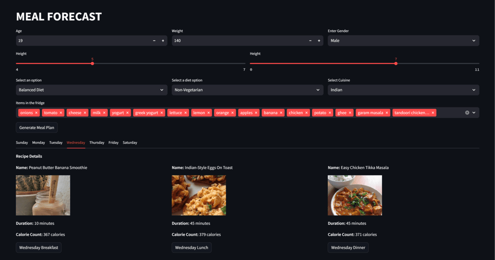

# Meal Forecast
Our project simplifies meal planning for busy college students by optimizing factors like nutrition, dietary restrictions, ingredients, variety, and prep time to generate personal weekly meal plans.

## Problem
In daily engaging activities such as attending to school and work, students and adults alike live in their own busy worlds, living under hard time constraints of their commitments such that health, our biggest wealth, becomes easier to ignore in light of time and convenience. Lack of nutrition and unsuccessful meal planning are some of the biggest problems to anyone's health. As notably mentioned by the CDC, 42% of America's adults have obesity as of 2022, placing them at a higher risk for type 2 diabetes, heart disease, and cancer. Exercise is cited as one of the biggest preventing forces, but it must be supplemented by a proper diet to be effective. We came up with a flexible solution as we understand, as college students, how difficult it is to manage making 3 meals a day with workload and classes occurring at varied times, all while maintaining a balanced diet and being determined towards long-term goals. While we have a lot of convenient and healthy eating options, the same opportunity may not extend to everyone. As such, we developed a web app in which users need to spend a few minutes, just once a week, to tell the app about their current inventory of raw food items. The app uses those to generate a comprehensive meal plan for the week that tries to minimize the cumulative time and effort on the user's end, achieve nutritional value that aligns with their goals, all while accounting for their dietary restrictions and eating preferences.

## Challenges we ran into
One of our main challenges was formulating our optimization problem for diet planning as we account for many factors beyond the nutrition facts of recipes. It took us immense research and fine tuning to weigh factors against each other, find appropriate cost policies per factor, and execute the appropriate training algorithm to find an optimal weekly meal plan. After exploring various approaches online to solving diet planning as an optimization problem, we continued our journey with the Genetic Algorithm approach. A good portion of work was also dedicated into gathering and deserializing large, raw data into parsed, usable data. Our data source allowed limited calls via API, so we made sure to get as much balanced data as we could. The data we encountered came with misspellings, mischaracterization of ingredients, missing data for key factors, and misrepresentation of itemized costs, all of which required of us to perform rigorous cleaning of the data before sending it through our genetic algorithm pipeline. Last, but not the least, the user interface was a challenge for our team, with all members primarily being experienced on the backend or data science side of things. Our attempts with website design on various platforms, such as Figma, failed to work out due to various incompatibilities and erroneous code configurations from design. Towards the end, our team sought a solution in website building through Streamlit.

## How to run our project
1) Clone this repository
2) Pip install the following packages: `pygad`, `streamlit`, `numpy`, `beautifulsoup4`, `seleniumbase`, `selenium`
3) Change directory to `backend`
4) Run `streamlit run website.py`
